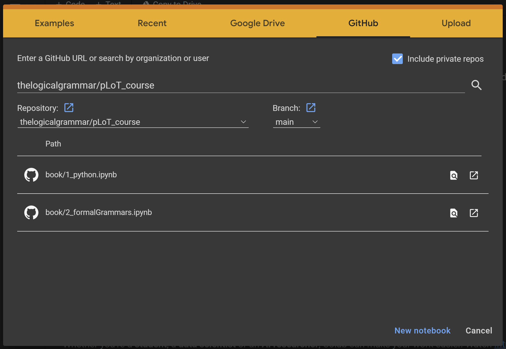

# How to get things running on colab

While static files are fine when it comes to just reading the labs, programming and technical knowledge can't be learned passively.
You need to try things out.
Therefore, during the labs we are going to use a service called google colab to host the notebooks and run them interactively. 
There are two main ways of getting colab running in the context of this course.

First method (fast and simple)
1. Go to the chapter you want to work on in this book.
1. Hover on the little spaceship button at the top of the page.
1. Click on the 'Colab' button from the menu that appears.

Second method (more generalizable to other contexts)
1. Open google colab by going to url 'https://colab.research.google.com/'
1. You should see something like this:

1. Click on 'github' in the yellow bar and type 'thelogicalgrammar/pLoT_course' on the searchbar.
1. A list of notebooks should appear, like this:

1. Click on the notebook you want to work with.
1. It should open a new google colab session.
1. Have fun!

Please don't hesitate to ask questions if anything is not clear or if something is not working.

